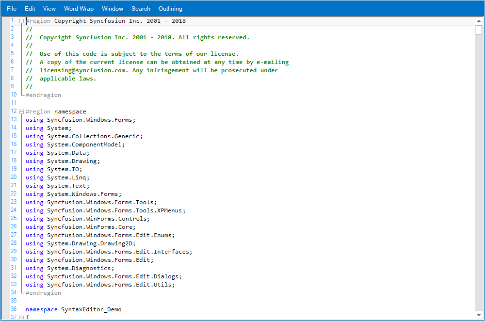

# WinForms Syntax Editor Getting Started

The [WinForms Syntax Editor](https://www.syncfusion.com/winforms-ui-controls/syntax-editor) is a powerful text editor control to create interactive code editor applications with its unique feature set. It has many efficient features such as editing, syntax highlighting, text indentation, intellisense, expand or collapse a block of code, and custom language configuration as in Microsoft Visual Studio Editor.

For know more about SyntaxEditor : https://www.syncfusion.com/winforms-ui-controls/syntax-editor

SyntaxEditor user guide documentation : https://help.syncfusion.com/windowsforms/syntax-editor/overview

## Overview

The WinForms Syntax Editor control is a powerful text editor control similar to the Microsoft Visual Studio editor. It provides a built-in syntax highlighting and code editing experience for popular languages . It offers all the essential features end users expect like syntax highlighting, editing, undo, redo, cut, copy, paste, IntelliSense, error validation, line numbering, highlighting modified lines, custom language configuration. It supports context choice, context tooltip, single line mode, multi-tasking with split view, word wrap, printing, and export options.

## Syntax highlighting

This control provides syntax highlighting for programming, scripting, and markup languages. It also allows users to customize built-in languages.

### Built-in language highlighting

The Syntax Editor control offers built-in syntax highlighting and code editing experiences for the following languages:

*	C#
*	VB.NET
*	XML
*	HTML
*	Java
*	SQL
*	PowerShell
*	C
*	JavaScript
*	VBScript
*	Delphi

### Configure custom language

Create custom syntax highlighting of keywords and operators of your own language.

## IntelliSense

IntelliSense displays a pop-up with a list of code completion options to speed up coding by reducing typos and other common mistakes.

## Context prompt

Display helpful pop-up hints about alternate syntax for invoking what is being typed and its parameters. Choose your invocation overload with the Up and Down arrow keys or by clicking the arrow buttons in the pop-up.

## Context tooltip

Built-in interactive tooltips appear automatically when the pointer is placed over a collapsed block of text.

## Code outlining

Display code blocks in a tree structure and expand and collapse the code blocks interactively for readability. WinForms Syntax Editor automatically chooses where to create outlines for built-in languages. 

## Comment and uncomment code

Comment or uncomment code with the help of the comment option. Users can select the required block of code to comment. WinForms Syntax Editor comments the current line when there is no selection.

## Tracking changes

Track the changed lines by displaying markers at the beginning of modified lines, after the file is loaded, or after the last file save operation.

## Advanced editor capabilities
### Undo and redo

Included is keyboard and context menu support for undo and redo operations.

### Clipboard operations

Use the keyboard or context menu for clipboard operations such as cut, copy, and paste.

### Selection

WinForms Syntax Editor supports rectangular block selection to select lines from specific columns, like in Visual Studio and also normal selection.

### Indent

Indentation support helps format source code to improve readability.

### Autocomplete

A list of choices helps complete the word a user is typing.

### Autocorrect

Predefined typing errors are auto corrected when users press certain keys. Users can also change their autoreplace trigger key.

### Line numbers

Display the line number at the start of a line to identify the current number and to show or hide the line number.

### Word wrap

Use different word wrapping styles, such as wrap by word or wrap by character, based on the available text area.

## Search and replace
### Search

Find occurrences of a specified text with constraints such as match case, match whole words, and search directions. Also search text in a specific scope like current document or within the selected content.

### Replace

Replace the specified text with the replacement text as per the conditions specified. Replace the first occurrence or all occurrences of the searched text.

## Context menu

Built-in context menu support for file editing and selection operations, and much more.

## Content dividers

Clearly distinguish content sections with line dividers similar to Visual Basic to improve code readability.

## Line formatting

### Highlight line

Highlight a particular line with a different background color. This helps users differentiate a specific line from the non-highlighted lines.

### Underline

Format text by underlining it with different styles such as solid, dash, wave, and dot lines.

## Bookmarks and navigation

### Bookmarks

Users can locate a section or a line of a document for quick access in WinForms Syntax Editor, which can also be later retrieved and reviewed.

### Navigation

Navigate to the next character, word, or start or end of a line using the keyboard. Users can jump to specific lines using go-to-line dialog.

## End-user capabilities

### Status bar

Display information about the current state of the control such as the current file name, line number, and column number.

### Shortcut keys

Shortcut keys can be used for all editing and navigation operations. A built-in window is available for modifying the key mapping of shortcut operations.

## Split view

Display a single document in several views with horizontal and vertical orientations, allowing users to work on different areas of a document at the same time.

## Single line mode

Make the Syntax Editor a simple text box with syntax highlighting, editing, and clipboard operations.

## Read-only

Use the WinForms Syntax Editor as a viewer control to view files and restrict code editing.

## Appearance

### Text appearance

Customize the appearance of the text color in a specific range of lines.

### Selection margin

Display a thin vertical strip that enables users to select the content of an entire line.

### Selection color

Change the background color of selected text in the control.

### Background customization

Users can customize the background color of the control and also use gradient effects.

* [See also WinForms Syntax Editor with rich ui documentation](https://help.syncfusion.com/windowsforms/syntax-editor/appearance)

## Customize the end-of-line character

Users can customize the end-of-line characters and choose to show or hide them.

## Style

Use a rich set of built-in themes inspired by popular interfaces such as Visual Studio, Microsoft Office, and Expression Blend.

* [learn more](https://help.syncfusion.com/windowsforms/syntax-editor/style)

## Globalization and localization

### Localization

The WinForms Syntax Editor supports localization to display control text and messages  in a  specific language.

### Right to left

Right-to-left (RTL) direction is available for users working with languages like Hebrew, Arabic, or Persian.

## Print and export

### Export

Export syntax editor content with associated syntax highlighting information to XML, HTML, and RTF file formats.

### Print

Print the syntax editor content programmatically or by using the print option from the print preview . The print preview window allows users to choose an entire document or just the current page and specify the number of copies to be printed.

## Related links
[Learn More about WinForms Syntax Editor](https://www.syncfusion.com/winforms-ui-controls/syntax-editor?utm_source=github&utm_medium=listing&utm_campaign=winforms-edit-github-samples)

[Documentation](https://help.syncfusion.com/windowsforms/syntaxeditor/overview?utm_source=github&utm_medium=listing&utm_campaign=winforms-edit-github-samples)

[Release History](https://help.syncfusion.com/windowsforms/release-notes/v19.4.0.47?utm_source=github&utm_medium=listing&utm_campaign=winforms-edit-github-samples)

[Online Demos](https://github.com/syncfusion/winforms-demos/?utm_source=github&utm_medium=listing&utm_campaign=winforms-edit-github-samples)

[Contact Support](https://www.syncfusion.com/support/directtrac/incidents/newincident/?utm_source=github&utm_medium=listing&utm_campaign=winforms-edit-github-samples)

[Suggest a feature or report a bug](https://www.syncfusion.com/feedback/winforms?utm_source=github&utm_medium=listing&utm_campaign=winforms-edit-github-samples)

[Pricing](https://www.syncfusion.com/sales/products/windowsforms?utm_source=github&utm_medium=listing&utm_campaign=winforms-edit-github-samples)

## About Syncfusion WinForms UI Controls
Syncfusion's [WinForms UI Controls](https://www.syncfusion.com/winforms-ui-controls?utm_source=github&utm_medium=listing&utm_campaign=winforms-edit-github-samples) library is the only suite that you will ever need to build an application since it contains over 100 high-performance, lightweight, modular, and responsive UI Controls in a single package. In addition to Syntax Editor, we provide popular WinForms Controls such as [DataGrid](https://www.syncfusion.com/winforms-ui-controls/datagrid?utm_source=github&utm_medium=listing&utm_campaign=winforms-edit-github-samples), [Charts](https://www.syncfusion.com/winforms-ui-controls/chart?utm_source=github&utm_medium=listing&utm_campaign=winforms-edit-github-samples), [Diagram](https://www.syncfusion.com/winforms-ui-controls/diagram?utm_source=github&utm_medium=listing&utm_campaign=winforms-edit-github-samples), and [Scheduler](https://www.syncfusion.com/winforms-ui-controls/syntax-editor?utm_source=github&utm_medium=listing&utm_campaign=winforms-edit-github-samples).

## About Syncfusion
Founded in 2001 and headquartered in Research Triangle Park, N.C., Syncfusion has more than 26,000+ customers and more than 1 million users, including large financial institutions, Fortune 500 companies, and global IT consultancies.

Today, we provide 1700+ components and frameworks for web ([Blazor](https://www.syncfusion.com/blazor-components?utm_source=github&utm_medium=listing&utm_campaign=winforms-edit-github-samples), [ASP.NET Core](https://www.syncfusion.com/aspnet-core-ui-controls?utm_source=github&utm_medium=listing&utm_campaign=winforms-edit-github-samples), [ASP.NET MVC](https://www.syncfusion.com/aspnet-mvc-ui-controls?utm_source=github&utm_medium=listing&utm_campaign=winforms-edit-github-samples), [ASP.NET WebForms](https://www.syncfusion.com/jquery/aspnet-webforms-ui-controls?utm_source=github&utm_medium=listing&utm_campaign=winforms-edit-github-samples), [JavaScript](https://www.syncfusion.com/javascript-ui-controls?utm_source=github&utm_medium=listing&utm_campaign=winforms-edit-github-samples), [Angular](https://www.syncfusion.com/angular-ui-components?utm_source=github&utm_medium=listing&utm_campaign=winforms-edit-github-samples), [React](https://www.syncfusion.com/react-ui-components?utm_source=github&utm_medium=listing&utm_campaign=winforms-edit-github-samples), [Vue](https://www.syncfusion.com/vue-ui-components?utm_source=github&utm_medium=listing&utm_campaign=winforms-edit-github-samples), and [Flutter](https://www.syncfusion.com/flutter-widgets?utm_source=github&utm_medium=listing&utm_campaign=winforms-edit-github-samples)), mobile ([Xamarin](https://www.syncfusion.com/xamarin-ui-controls?utm_source=github&utm_medium=listing&utm_campaign=winforms-edit-github-samples), [Flutter](https://www.syncfusion.com/flutter-widgets?utm_source=github&utm_medium=listing&utm_campaign=winforms-edit-github-samples), [UWP](https://www.syncfusion.com/uwp-ui-controls?utm_source=github&utm_medium=listing&utm_campaign=winforms-edit-github-samples), [JavaScript](https://www.syncfusion.com/javascript-ui-controls?utm_source=github&utm_medium=listing&utm_campaign=winforms-edit-github-samples), and [MAUI(Preview)](https://www.syncfusion.com/maui-controls?utm_source=github&utm_medium=listing&utm_campaign=winforms-edit-github-samples)), and desktop development ([WinForms](https://www.syncfusion.com/winforms-ui-controls?utm_source=github&utm_medium=listing&utm_campaign=winforms-edit-github-samples), [WPF](https://www.syncfusion.com/wpf-ui-controls?utm_source=github&utm_medium=listing&utm_campaign=winforms-edit-github-samples), [WinUI](https://www.syncfusion.com/winui-controls?utm_source=github&utm_medium=listing&utm_campaign=winforms-edit-github-samples), [Flutter](https://www.syncfusion.com/flutter-widgets?utm_source=github&utm_medium=listing&utm_campaign=winforms-edit-github-samples), [UWP](https://www.syncfusion.com/uwp-ui-controls?utm_source=github&utm_medium=listing&utm_campaign=winforms-edit-github-samples), and [MAUI(Preview)](https://www.syncfusion.com/maui-controls?utm_source=github&utm_medium=listing&utm_campaign=winforms-edit-github-samples)). We provide ready-to-deploy enterprise software for dashboards, reports, data integration, and big data processing. Many customers have saved millions in licensing fees by deploying our software.

This is a commercial product and requires a paid license for possession or use. Syncfusion’s licensed software, including this component, is subject to the terms and conditions of [Syncfusion's EULA](https://www.syncfusion.com/eula/es/?utm_source=github&utm_medium=listing&utm_campaign=winforms-edit-github-samples). To acquire a license, you can purchase one [here]( https://www.syncfusion.com/sales/products/windowsforms?utm_source=github&utm_medium=listing&utm_campaign=winforms-edit-github-samples) or start a free 30-day trial [here](https://www.syncfusion.com/account/manage-trials/start-trials?utm_source=github&utm_medium=listing&utm_campaign=winforms-edit-github-samples).

  <a href="mailto:sales@syncfusion.com?Subject=Syncfusion WinForms Syntax Editor - Github" target="_top">sales@syncfusion.com</a> | <a href="https://www.syncfusion.com?utm_source=github&utm_medium=listing&utm_campaign=winforms-edit-github-samples">www.syncfusion.com</a> | 1-888-9 DOTNET  

