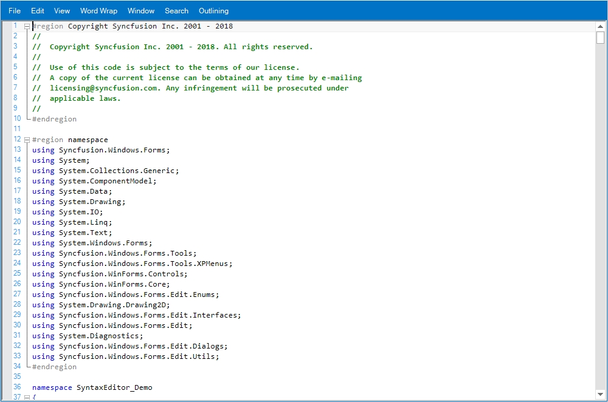

# WinForms Syntax Editor - Getting Started

The **EditControl** in Syncfusion's WinForms suite is a robust and feature-rich text editor control designed to build interactive and intelligent code editing applications. It offers a wide range of functionalities that make it ideal for developers looking to implement a Visual Studio-like experience in their Windows Forms applications.

With support for **syntax highlighting**, **text indentation**, **intellisense**, and **code block management** (expand/collapse), the EditControl enables users to write and manage code efficiently. It also allows for **custom language configurations**, making it adaptable to various programming languages and use cases. Whether you're building an IDE, a script editor, or a configuration file editor, this control provides the flexibility and power needed for professional-grade text editing.

### Key Features:

- Rich syntax highlighting for multiple languages.
- Smart indentation and formatting support.
- Intellisense-like suggestions for enhanced productivity.
- Expand/collapse functionality for code blocks.
- Customizable language definitions and parsing rules.
- Seamless integration with other Syncfusion controls.

To learn more about the **SyntaxEditor**, visit the official Syncfusion page:  
🔗 [Syncfusion SyntaxEditor Overview](https://www.syncfusion.com/winforms-ui-controls/syntax-editor)and implementation guidance, refer to the user guide:  
📘 [SyntaxEditor Documentation](https://help.syncfusion.com/windowsforms/syntax-editor/overview)
